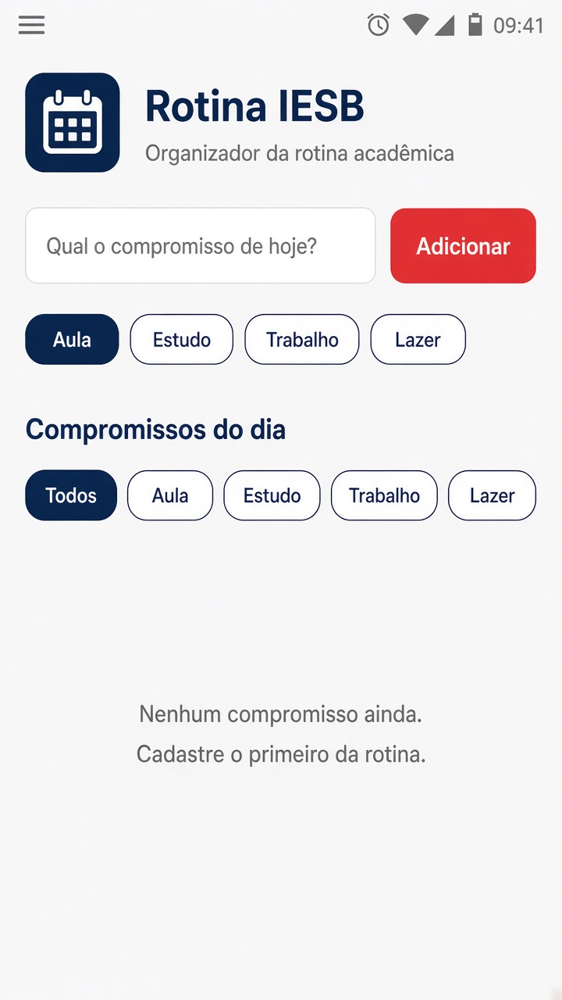
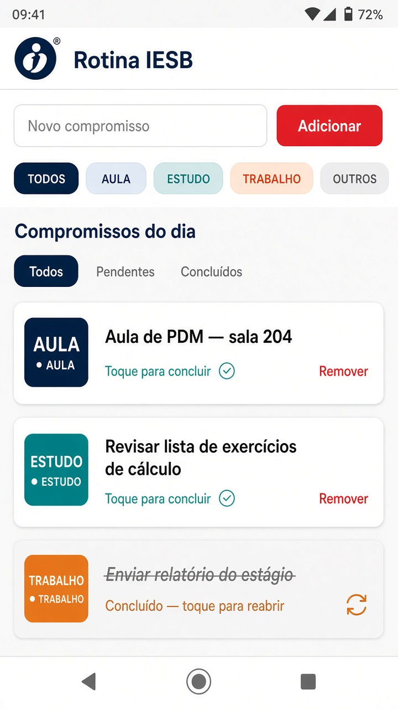
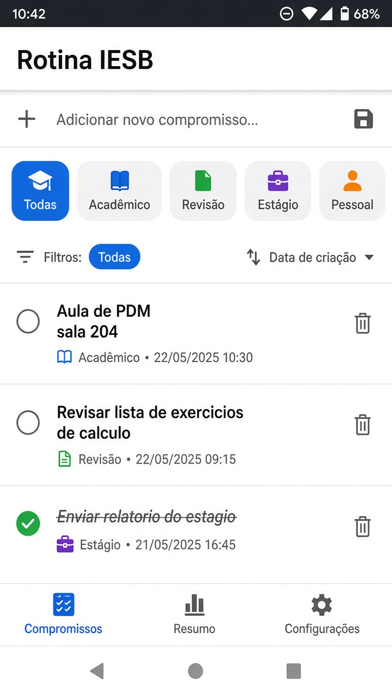

# RotinaIESB

Atividade integradora (aulas 02 a 06): organizador simples da rotina acadêmica no IESB. O aluno cadastra compromissos do dia, filtra por categoria, marca como concluído, remove itens e os dados permanecem após fechar o app.

## 1) Comando usado para criar o projeto

```bash
npx create-expo-app@latest RotinaIESB --template blank
cd RotinaIESB
npx expo install @react-native-async-storage/async-storage react-native-safe-area-context
```

### Como rodar

```bash
cd praticas/pratica06/RotinaIESB
npm install
npx expo start
```

Abra no Expo Go (Android/iOS). `node_modules` e `.expo` não entram no repositório.

## 2) Prints

### Tela vazia



### Com itens



### Após reabrir o app

A mesma lista reaparece: os dados foram lidos do AsyncStorage na montagem.



## 3) Onde estão os `useEffect`

Os dois efeitos ficam em `App.js`, chave `@rotina_iesb_compromissos`.

| Efeito | Quando roda | O que faz |
| :--- | :--- | :--- |
| **Carga** | `useEffect` com `[]` (montagem) | `AsyncStorage.getItem` + `JSON.parse` → `setCompromissos` |
| **Salvamento** | `useEffect` com `[compromissos, carregado]` | `AsyncStorage.setItem` + `JSON.stringify` |

O flag `carregado` evita gravar `[]` antes da leitura terminar. Erros caem em `try/catch` com `Alert`.

## 4) Arquivos criados

| Arquivo | Papel |
| :--- | :--- |
| `labels.js` | Exports nomeados (`tituloApp`, `placeholderCompromisso`, `botaoAdicionar`, `tituloLista`, `listaVazia`, …) |
| `components/CompromissoInput.js` | `TextInput` + botão + chips de categoria |
| `components/CompromissoList.js` | `FlatList`, filtro, conclusão e remoção |
| `assets/logo.png` | Imagem local do cabeçalho |

### Desafios opcionais (2)

- **O1.** Campo `categoria` (aula / estudo / trabalho / lazer) com filtro por `Pressable`.
- **O2.** Campo `concluido` e texto riscado ao tocar no item.

A lista usa `FlatList` com `ListEmptyComponent` (permitido nos requisitos).
